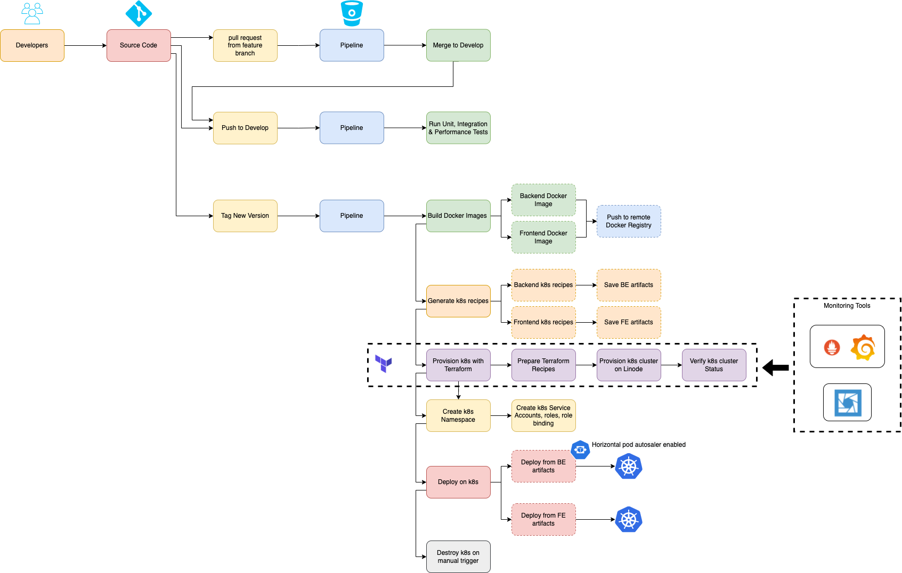

# react-spring

The following repository contains the CI/CD instructions to test and deploys a react frontend application on a kubernetes cluster as a replicated deployment with an exposed k8s service.

## Content
The content of this repository is divided into several locations as follow:

| File Path | Description |
| --- | ---|
| k8s| this folder contains 2 directories one for frontend deployment and another for backend deployment. |
| k8s/BE | this folder contains the dockerfile, the startup script for the backend deployment and the nginx virtual host entry that upstreams to the spring boot running instance. |
| k8s/FE | this folder contains the dockerfile, the startup script for the frontend deployment and the nginx virtual host entry that redirects the user to the generated react dist folder. |
| k8s/kube | this folder contains the k8s templates and a NodeJS script that uses ENV variables to generate the k8s deployment & service for each of the frontend or backend depending on the stage that invokes it. |
| k8s/artifacts | this folder contains a copy of the generated k8s recipes for each of Frontend and Backend after the entire pipeline finishes. |
| k8s/diagrams | this folder contains the blueprints and some high level overview of the application architecture, the pipeline stages and workflow, and the deployment overview on the k8s cluster. |
| bitbucket-pipeline.yml | this file contains the ci/cd pipeline instructions. |

## Architecture

#### Application Overview:
The following image visualize from a bird-eye view how the application is structure and how it is running on the hosting platform:

The code in the repository is divided into 2 different components where one handles the frontend and the other handles the backend.

Each deployment is accessible via a Nginx web server.

Requests arrive to the Nginx server and the latter redirects them to the react application of the spring boot backend api.

#### Deployment Overview:
The following image visualize from a bird-eye view how the application is deployed on a kubernetes cluster:

The application's components (as mentioned above ) are deployed on 2 different deployments where one handles the frontend, and the other handles the backend.

In addition, each deployment is configured as a replicaset with an exposed k8s service.

Requests hit the service, the latter redirects to the deployment, and the deployment load balances on its replicated pods.

#### Pipeline Overview:
The following image visualize from a bird-eye view how the ci/cd pipeline is configured and its workflow:

- When developers push a feature branch, the pipeline automatically merges that branch to the develop branch.

- When the develop branch is updated ( either by developers directly or via the first pipeline ), the pipeline in this case runs the tests: unit - integration - performance.

- When the developers tag a new version, the pipeline:
  - builds the docker images 
  - pushes them to the docker registry 
  - generate the k8s deployment recipes 
  - Using Terraform, provisions a new k8s cluster on Linode
  - Creates a new Namespace on the k8s cluster
  - Creates 2 service accounts on the k8s cluster: react - spring
  - connects to the k8s clusters and deploys/updates the components
  - provides a final step with manual trigger to destroy the k8s cluster on linode

## Pipeline Overview

The pipeline has several entry points:

- Automatically merge feature branches to the develop branch when pull requests are created
- Trigger testing the application by running unit/integration/performance tests each time the develop branch is updated
- Upon tagging a repository, build 2 docker images and deploy 2 replicated k8s deployments from these images: Backend and Frontend Deployments

This pipeline assumes that you have already configured the environment variables ( listed below ) that it requires to executed and that you have already provisioned a k8s cluster with a namespace.
The pipeline is generic and does not impose the usage of a specific cloud provider, it works with any docker registry and deploys on any kubernetes cluster.

## Environment Variables
Both docker images get generated in parallel and pushed to a remote docker registry.
During this stage, the pipeline builds the images using additional env variables:

| Env Var | Description |
| --- | ---|
| DOCKER_HUB_USER | the username on the remote docker registry | 
| DOCKER_HUB_REPO | the name of the image to generate |
| BITBUCKET_TAG | the tag of the image to generate matching the auto generated tag number on bitbucket |
| REACT_APP_ENV_VARS | the location of the backend api endpoint entry point that the frontend react application will connect to |

Once the Docker images are created, the pipeline executes a NodeJs script located in k8s/kube/kube.js.
This NodeJs script generates the kubernetes YAML recipes that instructs kubernetes the type of deployment to create and what to attach to it.
This Script also utilize multiple environment variable supplied by the bitbucket pipeline:

| Env Var | Description |
| --- | ---|
| DOCKER_HUB_USER | the username on the remote docker registry |
| DOCKER_HUB_REPO | the name of the image to generate |
| BITBUCKET_TAG | the tag of the image to generate matching the auto generated tag number on bitbucket |
| BITBUCKET_COMMIT | auto generated commit message used as env variable in the k8s deployment recipe to force a redeployment |
| DEPLOYMENT_NAME_SUFFIX | an optional prefix to use with the deployment names |
| DEPLOYMENT_REPLICAS | the initial number of replicas to use |
| READINESS_PROBE_PORT | the readiness probe port to use |
| READINESS_PROBE_PATH | the readiness probe path to use |
| AUTOSCALE_CPU_LIMIT | the autoscale unit metric that the k8s HPA checks |
| DOCKER_IMAGE_PULL_POLICY | the docker image pull policy |
| DOCKER_PRIVATE_REGISTRY | the docker registry secret to use if the registry is private |
| STARTUP_CMD | the location of the startup command that executes when the pods of the deployment launch |
| DYNAMIC_EXTERNAL_PORTS | a stringified JSON configuration instructing the configuration of how the exposed ports of the attached service should happen |
| PORT_TYPE | the type of port exposure to use with the service like | LoadBalancer, NodePort ... |
| CUSTOM_XXX | optional list of custom env variables related to the internal logic of the application. |
| SECRET_ENV_XXX | optional list of custom k8s secret names that should attach to this deployment. |
| KUBENS | the namespace to use on k8s to deploy in
| LINODE_API_TOKEN | The Linode Service Account API Token to allow Terraform to connect to linode to provision the k8s cluster

### Environment Variables Configuration
Environment Variables are configured using the bitbucket interface under **repository settings**.

These variables are classified under 2 categories: global - environment.

#### Global ENV Variables
These variables do not change no matter which environment is running.

*(example taken from www.jamalouki.net cicde pipeline, similar to this assignment)*

#### Environment ENV Variables
These variables are different in each environment that is running.

*(example taken from www.jamalouki.net cicde pipeline, similar to this assignment)*

## Examples
Please refer to the examples under folder **k8s/artifacts** to see how the generated k8s recipes look like.