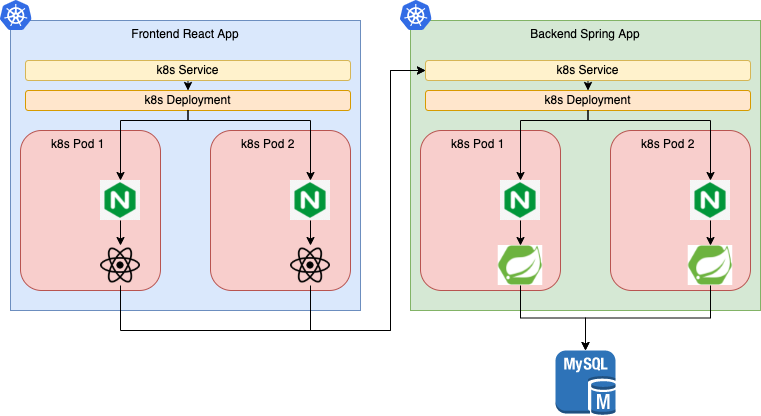
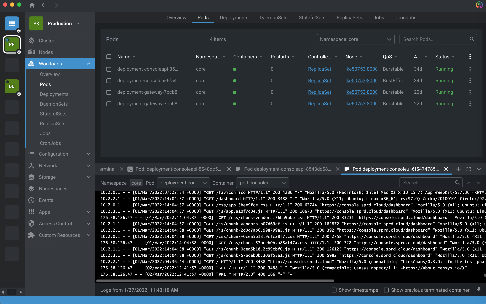

# react-spring

The following repository contains the CI/CD instructions to test and deploys a react frontend application on a kubernetes cluster as a replicated deployment with an exposed k8s service.

## Content
The content of this repository is divided into several locations as follow:

| File Path | Description |
| --- | ---|
| k8s| this folder contains 2 directories one for frontend deployment and another for backend deployment. |
| k8s/BE | this folder contains the dockerfile, the startup script for the backend deployment and the nginx virtual host entry that upstreams to the spring boot running instance. |
| k8s/FE | this folder contains the dockerfile, the startup script for the frontend deployment and the nginx virtual host entry that redirects the user to the generated react dist folder. |
| k8s/kube | this folder contains the k8s templates and a NodeJS script that uses ENV variables to generate the k8s deployment & service for each of the frontend or backend depending on the stage that invokes it. |
| k8s/rbac | this folder contains the k8s templates for creating RBAC configuration to restrict the access of users to specific resources and operations on the kubernetes cluster. |
| k8s/artifacts | this folder contains a copy of the generated k8s recipes for each of Frontend and Backend after the entire pipeline finishes. |
| k8s/diagrams | this folder contains the blueprints and some high level overview of the application architecture, the pipeline stages and workflow, and the deployment overview on the k8s cluster. |
| tf | this folder contains the IaC templates & recipes that allows terraform to provision a new k8s cluster on a linode account.
| bitbucket-pipeline.yml | this file contains the ci/cd pipeline instructions. |

## Application Overview
The following image visualize from a bird-eye view how the application is structure and how it is running on the hosting platform:


The code in the repository is divided into 2 different components where one handles the frontend and the other handles the backend.

Each deployment is accessible via a Nginx web server.

Requests arrive to the Nginx server and the latter redirects them to the react application of the spring boot backend api.

The spring Backend APIs, that are running inside the pods of the Spring deployment, operate on an SQL Database that is hosted on a separate virtual machine.

### Important Notes

The application will run on a kubernetes (k8s) cluster. 

The connection details to the mysql cluster will be provided to the Spring deployment as a secret.

This secret is created by the pipeline before the Backend Deployment is created and under the same namespace.

The code snippet for the database cluster is located in this repository in this file [mysql credentials secret](./k8s/artifacts/mysql_credentials.yaml).

Then when the pipeline creates the backend deployment, the latter is pre-configured to consume this secret and use it.

The [Backend API k8s Artifact](./k8s/artifacts/BE/deployment.yaml) inside this repo contains the code snippet of how the secret is consumed as an environment variable inside the deployment.  

Once the backend pod is created, the k8s recipe instructs running a shell file **[start.sh](./k8s/BE/script/start.sh)**.

This file loads the volumed k8s secret as an environment variable, parses it and creates a new yaml file "mysql_configuration.yaml" on the file system of the pod.

The Java code in the pod, then parses this yaml file, extracts the connection configuration information and passes it to the Java code and the latter establishes a connection to the MySQL Database.

```shell
echo "Extract Database Information"
cd /opt/reactapp/BE/
echo -n "$MYSQL_CREDENTIALS" | base64 -d > /cd /opt/reactapp/BE/mysql_configuration.yml
```

## Deployment Overview
The following image visualize from a bird-eye view how the application is deployed on a kubernetes cluster:


The application's components (as mentioned above ) are deployed on 2 different deployments where one handles the frontend, and the other handles the backend.

In addition, each deployment is configured as a replicaset with an exposed k8s service.

Requests hit the service, the latter redirects to the deployment, and the deployment load balances on its replicated pods.


## Pipeline Overview
The following image visualize from a bird-eye view how the ci/cd pipeline is configured and its workflow:


- When developers push a feature branch, the pipeline automatically merges that branch to the develop branch.

- When the develop branch is updated ( either by developers directly or via the first pipeline ), the pipeline in this case runs the tests: unit - integration - performance.

- When the developers tag a new version, the pipeline:
  - builds the docker images 
  - pushes them to the docker registry 
  - generate the k8s deployment recipes 
  - Using Terraform, provisions a new k8s cluster on Linode
  - Creates a new Namespace on the k8s cluster
  - Creates 2 service accounts on the k8s cluster: react - spring
  - connects to the k8s clusters and deploys/updates the components
    - The backend deployment is configured with a horizontal pod autoscaler that monitors the CPU usage and scales this deployment dynamically when that limit is reached.
  - provides a final step with manual trigger to destroy the k8s cluster on linode

### RBAC
Since the application will be deployed on the kubernetes cluster, the pipeine is configured to configure and set up 2 services accounts using RBAC k8s templates.

The role-based access control authorization (RBAC) is a method of regulating access  to resources based on the roles of individual users.

This pipeline creates one service account for the frontend React Application and another for the backend Spring Java Application.

You can learn more about the kubernetes RBAC system on [this link](https://kubernetes.io/docs/reference/access-authn-authz/rbac/).


### Terraform
The pipeline relies on [Terraform](www.terraform.io) to provision and destroy the kubernetes cluster.

The following files are included in the pipeline and contain the code of these tasks:
- Provision k8s cluster [./tf/provision.sh](./tf/provision.sh)
- Destroy k8s cluster [./tf/destroy.sh](./tf/destroy.sh)

The pipeline also contains inline code documentation that sheds light on the purpose of each stage configured in it and its internal steps.

## Pipeline Overview

The pipeline has several entry points:

- Automatically merge feature branches to the develop branch when pull requests are created
- Trigger testing the application by running unit/integration/performance tests each time the develop branch is updated
- Upon tagging a repository, build 2 docker images, provisions a new k8s cluster, and deploys 2 replicated k8s deployments from these images: Backend and Frontend Deployments

This pipeline assumes that you have already configured the environment variables ( listed below ) that it requires to execute
The pipeline is generic but imposes the usage of linode as a cloud provider to provision the k8s cluster. However, it works with any docker registry.

## Terraform
The pipeline utilizes terraform as an IaC to provision a kubernetes cluster on linode.

Terraform is also capable of provisioning clusters and other types of infrastructure component on different cloud providers and not just Linode.

For example, you can use Terraform to provision the same kubernetes cluster on Microsoft Azure [Click here to learn more](https://docs.microsoft.com/en-us/azure/developer/terraform/create-k8s-cluster-with-tf-and-aks).

The difference between cloud providers however affect the code that gets written in the terraform scripts.

### Example
The following table provides reference links to terraform files that are included in this repository for both Linode and Azure.

These files contain the Terraform scripts to provision a kubernetes cluster.

| Linode TerraForm | Azure TerraForm |
| --- | --- |
| [Linode Terraform Script to create K8s Cluster](./tf/main.tf) | [Azure Terraform Script to create K8s Cluster](./tf/azure/main.tf) |
| [Linode Terraform Variables](./tf/variables.tf) | [Azure Terraform Variables](./tf/azure/variables.tf) |

## Environment Variables
Both docker images get generated in parallel and pushed to a remote docker registry.
During this stage, the pipeline builds the images using additional env variables:

| Env Var | Description |
| --- | ---|
| DOCKER_HUB_USER | the username on the remote docker registry | 
| DOCKER_HUB_REPO | the name of the image to generate |
| BITBUCKET_TAG | the tag of the image to generate matching the auto generated tag number on bitbucket |
| REACT_APP_ENV_VARS | the location of the backend api endpoint entry point that the frontend react application will connect to |

Once the Docker images are created, the pipeline executes a NodeJs script located in k8s/kube/kube.js.
This NodeJs script generates the kubernetes YAML recipes that instructs kubernetes the type of deployment to create and what to attach to it.
This Script also utilize multiple environment variable supplied by the bitbucket pipeline:

| Env Var | Description |
| --- | ---|
| DOCKER_HUB_USER | the username on the remote docker registry |
| DOCKER_HUB_REPO | the name of the image to generate |
| BITBUCKET_TAG | the tag of the image to generate matching the auto generated tag number on bitbucket |
| BITBUCKET_COMMIT | auto generated commit message used as env variable in the k8s deployment recipe to force a redeployment |
| DEPLOYMENT_NAME_SUFFIX | an optional prefix to use with the deployment names |
| DEPLOYMENT_REPLICAS | the initial number of replicas to use |
| READINESS_PROBE_PORT | the readiness probe port to use |
| READINESS_PROBE_PATH | the readiness probe path to use |
| AUTOSCALE_CPU_LIMIT | the autoscale unit metric that the k8s HPA checks |
| AUTOSCALE_CPU_PERCENT | the autoscale cpu metric metric that the k8s HPA uses to determine whether or not to scale this deployment |
| AUTOSCALE_MAX_POD | the autoscale maximum replica pod limit that the k8s HPA uses |
| DOCKER_IMAGE_PULL_POLICY | the docker image pull policy |
| DOCKER_PRIVATE_REGISTRY | the docker registry secret to use if the registry is private |
| STARTUP_CMD | the location of the startup command that executes when the pods of the deployment launch |
| DYNAMIC_EXTERNAL_PORTS | a stringified JSON configuration instructing the configuration of how the exposed ports of the attached service should happen |
| PORT_TYPE | the type of port exposure to use with the service like | LoadBalancer, NodePort ... |
| CUSTOM_XXX | optional list of custom env variables related to the internal logic of the application. |
| SECRET_ENV_XXX | optional list of custom k8s secret names that should attach to this deployment. |
| KUBENS | the namespace to use on k8s to deploy in
| LINODE_API_TOKEN | The Linode Service Account API Token to allow Terraform to connect to linode to provision the k8s cluster

### Environment Variables Configuration
Environment Variables are configured using the bitbucket interface under **repository settings**.

These variables are classified under 2 categories: global - environment.

#### Global ENV Variables
These variables do not change no matter which environment is running.

*(example taken from www.jamalouki.net cicd pipeline, a client of mine, that happens to be similar to this assignment)*

#### Environment ENV Variables
These variables are different in each environment that is running.

*(example taken from www.jamalouki.net cicd pipeline, a client of mine, that happens to be similar to this assignment)*

## Managing the Infrastructure
The application gets deployed on a kubernetes cluster.

This cluster is provisioned on ["**Linode**"](www.linode.com) Cloud Provider.

Once the cluster is set, you can use the [linode Dashboard](https://cloud.linode.com/kubernetes/clusters) to manage it.

In the terraform variable template file [./tf/terraform.tfvars.tmpl](./tf/terraform.tfvars.tmpl), the recipe instructs creating a cluster with a pool of 2 worker nodes.

Once the cluster is created, you can turn on the autoscaler through the linode dashboard.


# Monitoring the Infrastructure

All cloud providers provide the mechanism to monitor the infrastructure you set up through their Dashboard.

Using [Linode Dashboard](https://cloud.linode.com/kubernetes/clusters), you can monitor the status of each Worker node in your k8s cluster.


## Metrics & Analytics
In addition and to take things one step further, you can install additional tools to your kubernetes cluster that expose extra metrics from running pods.

These metrics are then collected and displayed via a graphical user interface thereby providing the means to monitor the status and health of the running components of the application.

Once the Kubernetes cluster is set up, you can deploy these monitoring tools.

This guid mentions 2 tools that you can use to monitor your cluster.

#### First Tool

The most common monitoring tool used with a kubernetes clusters consists of installing both Prometheus and Grafana.


Prometheus provides the mechanism to collect and expose metrics from the kubelet.

Grafana collects these exposed metrics and displays them withing a user interface.

Both tools work together to sping up a dashboard that give insight on the status and health of the kubernetes cluster and the running pods in it.

The following guide [Linode LKE using Prometheus and Grafana ](https://www.linode.com/docs/guides/lke-continuous-deployment-part-11/) 
provides all the required instructions step by step that you should follow to install and configure both tools on your Linode kubernetes cluster ( LKE ).

#### Second Tool
If you prefer to take things one step further, one of the best tools that DevOps Love is [LENS](www.k8slens.dev).

LENS provides multiple features that allow to connect to several kubernetes clusters, LKE among them, to monitor and operate on all deployments, configuration, secrets, services, configuration maps, namespaces ... etc ( basically anything that kubernetes offers).

| Cluster Overview | Configure Metrics | Pod Overview | Pod Monitor | Pod Exec | Pod Logs | 
| --- | ---| ---| ---| ---| ---|
|  |  |  | |  |  |

## Examples
Please refer to the examples under folder **k8s/artifacts** to see how the generated k8s recipes look like.